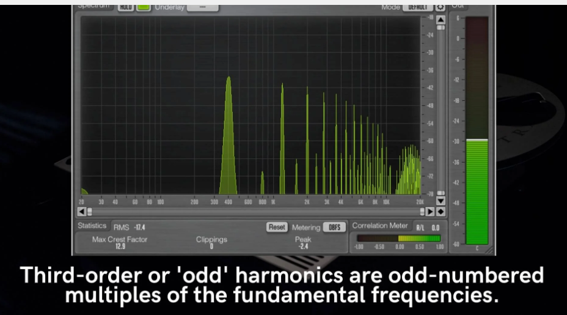
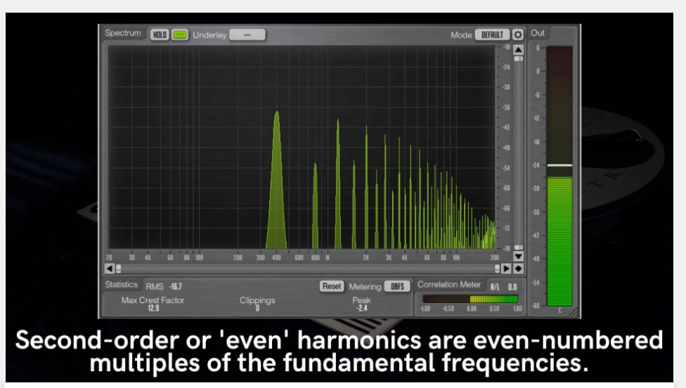
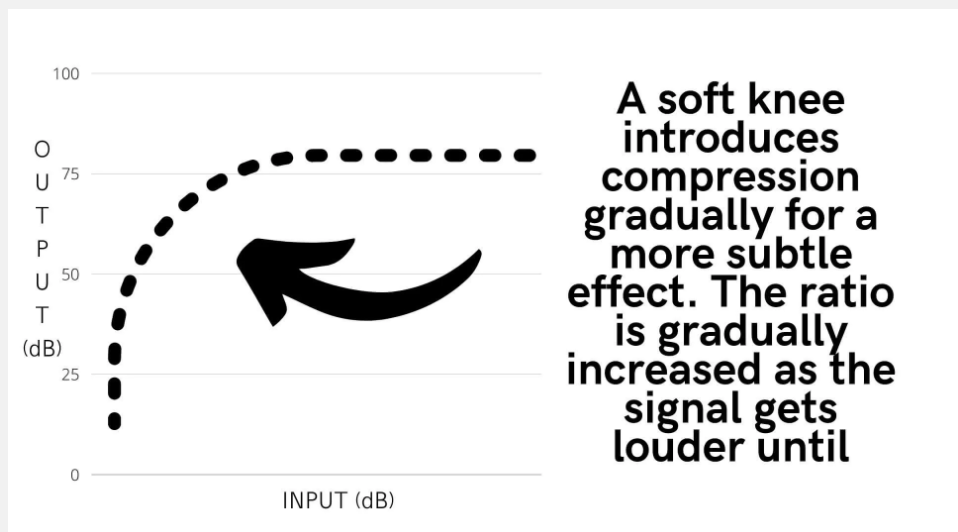
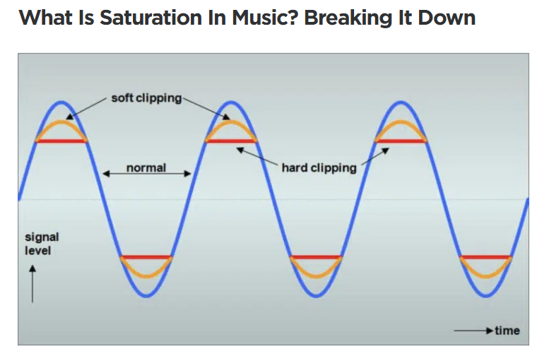
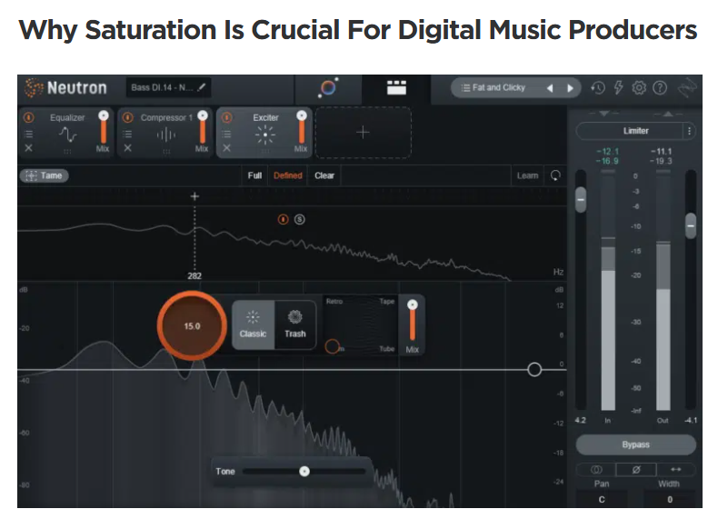
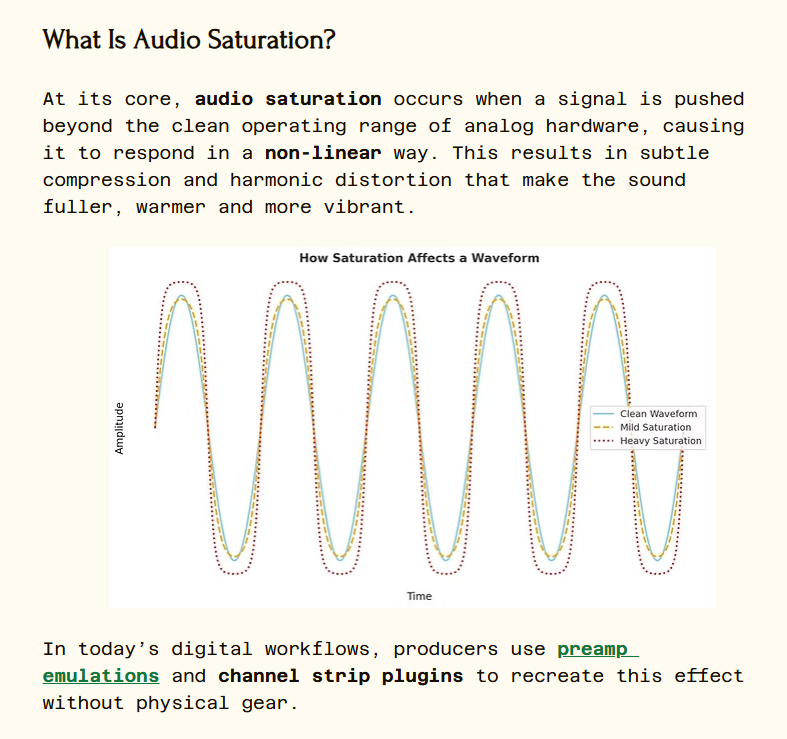
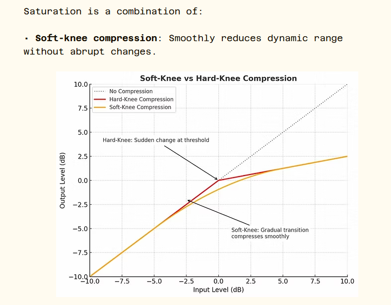
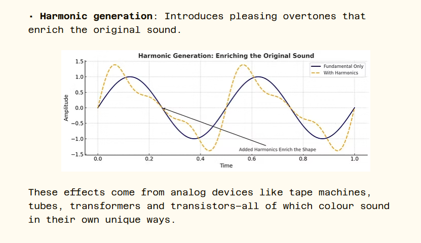

https://www.masteringthemix.com/blogs/learn/how-to-use-saturation?srsltid=AfmBOorqVFj4_4_-pkgmSzsi9qnukJnWh57Hxbf34Dq8vgDEf1-MTySX

What Is Saturation?
Saturation occurs when the electrical components of a piece of hardware are overloaded. When an electrical component (like a transistor, vacuum tube or magnetic tape) can no longer handle the incoming electrical signal, the output becomes non-linear to the input, resulting in compression and distortion.

Saturation introduces soft-knee compression, which means the ratio becomes more aggressive as the input increases. This results in a more gradual compression effect that is more subtle. For instance, if you just barely overload a circuit, it may apply compression at a ratio of 2:1, but as you increase the input gain, the ratio could be as high as 4:1 or higher.

https://unison.audio/saturation-in-music/

https://www.electronicproduction.co.uk/post/audio-saturation-how-it-transforms-your-sound

Soft-knee compression: Smoothly reduces dynamic range without abrupt changes.

Harmonic generation: Introduces pleasing overtones that enrich the original sound.

How Saturation Alters Audio Waveforms

Saturation isn’t just about tone - it reshapes audio waveforms. Here’s what happens:

• Waveform Compression: Loud and soft parts are brought closer together.

• Peak Limiting: Peaks are “shaved” off - soft clipping instead of harsh distortion.

• Transient Softening: Attacks become slightly rounded, creating musical smoothness.

• Dynamic Range Reduction: Helps create a more balanced, glued-together mix.

Harmonic Enhancement: The Heart of Saturation

One of the most valuable results of saturation is harmonic enhancement. These harmonics enrich the sound and make it more engaging:

• Even-Order Harmonics: Octave-based; warm, musical, and smooth.

• Odd-Order Harmonics: Third-based; gritty, edgy, and full of presence.

The ratio of these harmonics depends on the gear or plugin you’re using. For example:

• Tape saturation = mostly even-order → vintage, mellow tone.

• Tube saturation = both even + odd → rich, full-bodied sound.

• Transistor saturation = mostly odd-order → sharper, aggressive texture.

https://www.sweetwater.com/store/detail/AbbeyRdSat--waves-abbey-road-saturator-plug-in

